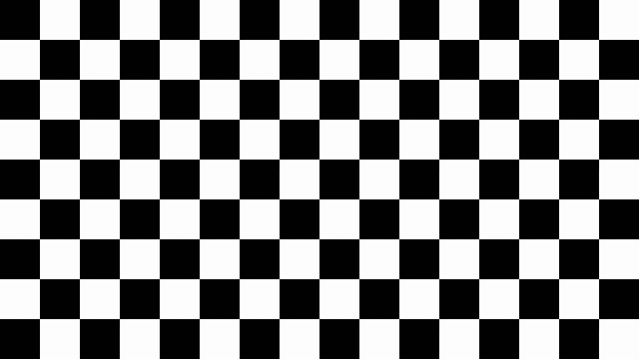

# Tsoding 
Youtube URL : https://www.youtube.com/@Tsoding

# Structure : 

- `shadow-data-trick/` : 
__Sources__: From [Youtube VOD](https://www.youtube.com/watch?v=gtk3RZHwJUA) 
__Description__: Explore how to implement dynamic arrays and hash tables in C by storing metadata outside the array pointer. Witness the creation of custom macros to handle memory allocation, reallocation, and deallocation seamlessly. 

- `malloc/` : Implementing your own version of `malloc` in C. [Youtube VOD](https://www.youtube.com/watch?v=sZ8GJ1TiMdk)

- `ppm.cpp`
__Sources__ : from [Tsoding](https://www.youtube.com/watch?v=xNX9H_ZkfNE)   
__Description__: Video in two part    
First is how to use the PPM format to generate image and then feed it to ffmpeg to create a video.   
Second part is how we implement shader in CPU from a 195 chars of GLSL from XorDev (Original tweet : https://x.com/XorDev/status/1894123951401378051)

Gifs of the video part one : 

Gifs of the video part two :  